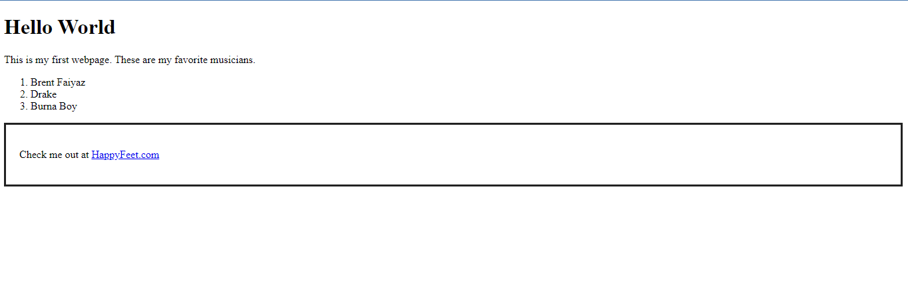

title: Introduction to HTML Tags
slug: https://10xdev.codeparrot.ai/
cover image: Upload the relevant image at https://hashnode.com/uploader and use the url

# Introduction to HTML Tags

HTML (Hypertext Markup Language) is the standard programming language used to create content displayed on a web page. It is a fundamental building block on which website designs are developed on the internet.

In this article, we will discuss several important HTML tags and how you can use those HTML tags. By the end of this guide, you will be able to confidently write HTML code and utilize them in building your websites. 

## HTML Tags and Examples

HTML tags usually begin with a greater than sign, and then end with a less than sign (<html>) when opening them, but to close them off, a forward slash is added before the less than sign (</html>). Some basic examples of HTML tags include;

1. The `<html>` tag
2. The header `<head>` tag
3. The `<body>` tag
4. The `<h1>` to `<h6>` tags
5. The paragraph `<p>` tag
6. The `<div>` tag
7. The image `` tag
8. The hyperlink `<a>` tag
9. The list `<ul>` and `<ol>` tags
10.  The `<iframe>` tag

Most HTML tags are paired this way as this indicates where the particular tag begins and ends. 

## Using HTML Tags

In this next section, we will discuss the previously listed 10 HTML tags in detail. You will become familiar with the syntax and explore examples of using these tags. 

### The Open and Close Tags 

The HTML tag is the first tag used as this indicates that the entire page is encapsulated in HTML. The following declares the HTML version is HTML5

```html
<html>
  <!-- Browser Content-->
</html>
```

### The Header Tags

The Head tag indicates the header of the web page. Content meant to be in the header is written within this tag.

```html
<head>
  <title>Hello World</title>
</head>
```

### The Body Tags

The Body tag indicates the main body of the web page. Most of the content on the web page, be it paragraphs, links, and other media, is encapsulated within this tag. The body makes up for most of the content on the web page. 

```html
<body> 
 <h1>The Main Webpage</h1> 
 <p>This is the main content.</p> 
</body>
```

### The Heading Tags

The heading tags define the font size of the headers. It usually points out which part of the header is more important than the other. `<h1>` indicates the biggest or most important while `<h6>` indicates the smallest or least important. 

```html
<h1>Main Header</h1>
<h2>Subheading</h2>
```

### The Paragraph Tag

The `<p>` tag is used to indicate the start of a new paragraph. Be careful not to forget to close off the tag `</p>` to mark the end of that particular paragraph. 

```html
<body>
<p>Lorem ipsum dolor paragraph </p>
</body>
```

### The Div Tag

The `<div>` tag is used for secluding a portion of the content to apply styling. Different design functions like ‘style’ and ‘padding’ can be implemented in the `<div>` tag.

```html
<div style="border: 3px solid #000; padding: 20px;">
  <p>10x Frontend Developer</p>
</div>
```

As you can see above, the ‘style’ and ‘padding’ functions are only applied to the paragraph “10x Frontend Developer ’’.

### The Image Tag

The `` tags are used when inserting images into the web page. Images in your device storage can easily be inserted into the web page by using this tag along with the ‘alt’ function to describe the image.

```html

```

### The Hyperlink Tag

The Hyperlink tag is used when inserting links to external resources or websites. When a user clicks on a text embedded in this tag, it automatically redirects them to an external website.

```html
<a href="https://www.HappyFeet.com"> Available at HappyFeet.com</a>
```

### The List Tags

As the name implies,  the list tags are used to create lists on the web page. `<ul>` creates an “Unordered List” while `<ol>` creates an “Ordered List”.

```html
<ul>
  <li>Micheal Scofield</li>
  <li>Barry Allen</li>
  <li>Frank Ocean</li>
</ul>

<ol>
  <li>Eggs</li>
  <li>Bread</li>
  <li>Milk</li>
</ol>
```

### The Iframe Tag

The `<iframe>` tag is used when inserting external files like thumbnails into your web page. This is essential for adding external media to your web page.

```html
<iframe src="https://www.HappyFeet.com"
 width="400" height="200"></iframe>
```

# Implementing HTML Tags

The above tags are important parts of HTML and can not be overlooked. It is important for any web developer to master or at least have an idea of the tags, their uses and how to adequately implement them to create a complete web page. If a tag is not properly implemented, like not being closed off properly, the tag is rendered invalid and hence can not affect the web page.

```html
<!DOCTYPE html>
<html>

<head>
  <h1>Hello World</h1>
</head>

<body>
  <p> This is my first webpage. These are my favorite musicians.
  <ol>
    <li>Brent Faiyaz</li>
    <li>Drake</li>
    <li>Burna Boy</li>
  </ol>
  <p>
  <div style="border: 3px solid #222; padding: 20px;">
    Check me out at <a href="https;//www.HappyFeet.com">HappyFeet.com</a>
  </div>
  </p>
  </p>
</body>

</html>
```

The image below shows the results of the HTML code above:



As you can see, all the tags here are promptly closed off, and all the content on the web page is encapsulated in the html tag.

## Conclusion

You have learned about the basic HTML tags and their functions, but of course, there are many more tags with their different uses, some don't even need to be closed off. To learn more about these tags, log on to   [https://www.w3schools.com/tags/ref_byfunc.asp](https://www.w3schools.com/tags/ref_byfunc.asp) for more examples.